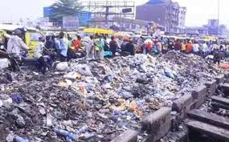
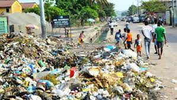
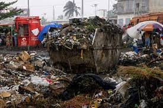
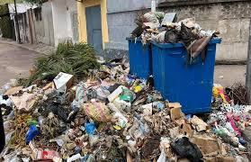
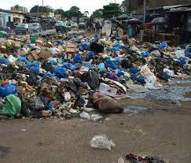
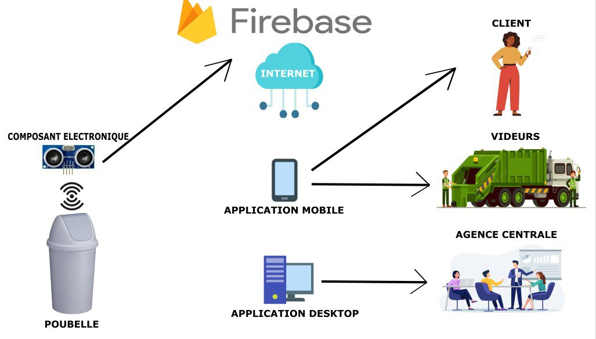

# MBINDO SOLUTION CHALLENGE PROJECT

We are a team of students from the salama computer science school, we currently live in CongoDRC made up of:

#### KEN MWEPU
#### ANDRE MUTOKE
#### GUSTAVE MUFUNGA and
#### CHRINOVIC MUKEBA

And we are candidates for the google solution challenge and our solution is called MBINDO

In the Democratic Republic of the Congo (as in several African countries) waste management is really a difficult thing, people live in an unhealthy environment and this is the cause of several diseases, including malaria, typhoid fever, cholera, etc. ... 

And we wanted to remedy this problem by proposing a digital solution that we called MBINDO

For our solution, we have chosen to respond to 2 United Nations Sustainable Development Goals 17

<b>The 3rd goal: Good health and well-beingM</b>  
<b>And Goal 6: Clean Water and Sanitation</b>

BOPETO is an application that will allow the quick and easy management of dirt in our city

And our solution has 3 parts :
<strong>The IoT part,  
Mobile part 
And the Desktop part</strong>

For the <strong>Iot </strong> part, we have a smart bin equipped with an ultrasonic sensor and a USP32 coulter

The <strong>Mobile</strong> part is reserved for customers (individuals) and for the garbage collectors service

<strong>For the customers</strong> :

He can see the status of the trash can,
Know the level of the trash can

<strong>For the scavenger</strong> :

He can see the status of the bins affiliated with the services
See the route to the nearest full bin

The <strong>Desktop</strong> part is reserved for the central (at the service of the garbage collectors)
They can see all trash cans and geolocations
They can see the numbers of customers affiliated with the services and see the status of all the bins to dispatch a nearest team to empty the different bins

## This solution will help improve dirt management and prevent many dirt-related diseases.

This is the presentation of our solution

We hope to have a favorable response from you, thank you